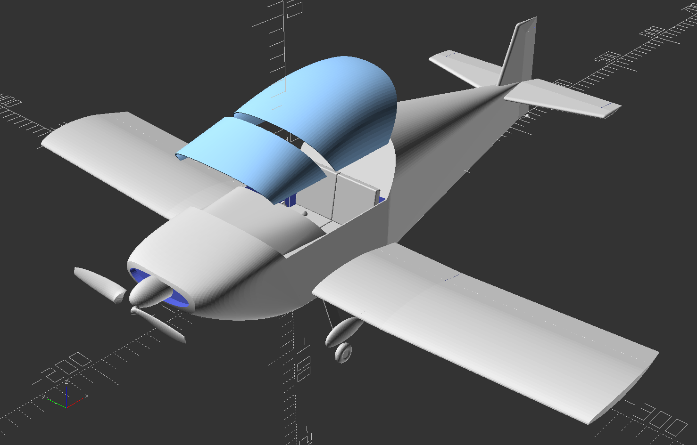

# Sonex-B Kit - OpenSCAD model for GeoFS

An experimental kit airplane replica for GeoFS, inspired by images and measurements on the manufacturers website. Not all the values are perfectly legit, especially the flight model in the game is using "game values" to reflect a plausible physics model.

The model was started as Onex base with foldable wings (wingspan ~20ft) but then was finished with a Sonex-B (2-seater) fuselage.
As the game supports folded wings I just left them in, so it's a truly experimental version.

The blender file has some additional changes (compass, canopy handle, AP button, split ailerons) as those changes were made directly in blender.

## references
- [GeoFS](https://www.geo-fs.com/)
- [Sonexaircraft](https://www.sonexaircraft.com/)

## libraries used
- [The Belfry OpenScad Library, v2.0](https://github.com/BelfrySCAD/BOSL2)
- [Elliptical-blade NACA airfoil propeller](https://www.printables.com/model/159163-elliptical-blade-naca-airfoil-propeller-library)
- [Path extrude](https://github.com/gringer/bioinfscripts/blob/master/path_extrude.scad)

## license
Sonex-B Kit is licensed under
Creative Commons Attribution 4.0 International License.

You should have received a copy of the license along with this
work. If not, see <https://creativecommons.org/licenses/by/4.0/>.